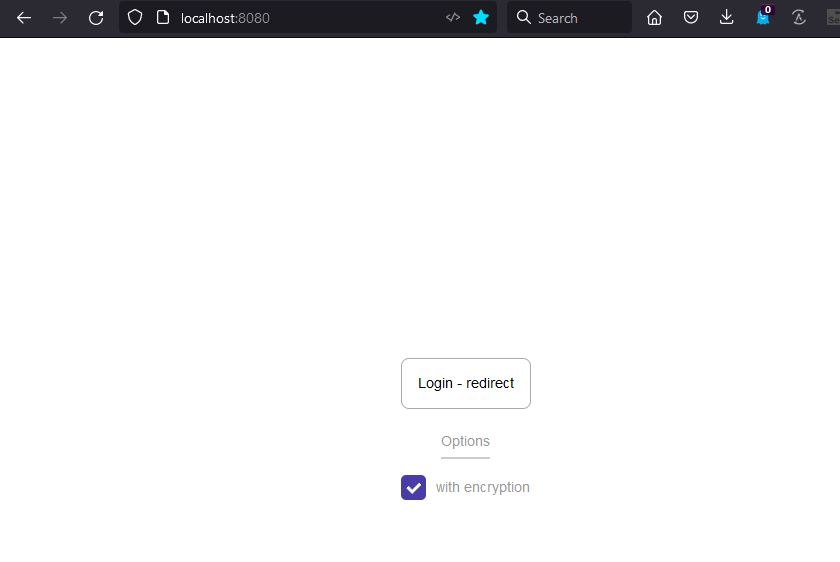

# react-samlify

Fork from https://github.com/authenio/react-samlify

**Disclaimer: This repository provide a minimal implementation for SAML based login with jumpCloud identity provider. Therefore, it is not a production ready implementation especially the handling of storing token and user account. We try to keep this repository to be very simple and get you idea on how to integrate your current application with samlify, even though you only have basic knowledge on SAML-based implementation.**

We will continue to add more common identity providers like EU Login in this example repository.

## Development

```console
yarn
yarn run dev
```


## Docker

```console
docker-compose up
```


## Credential for jumpCloud Login

```
Username: demo@fokus.test
Password: VDj7XWm4NMpx9LA!#1234
```


## Features Completed

- [x] SP-init SSO, jumpCloud IDP with (redirect/post) binding (Encrypted/Signed/Encrypted + Sign)
- [x] SP-init SLO, jumpCloud IDP with (redirect/post) binding

**Remarks: If SP-initiate SSO works, IDP initiate SSO works as well.**

## Home screeen
Here's an image of a home in action:



After user login


